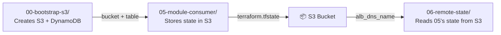

# Deployment Activity: `06-remote-state`

## Status: ✅ End-to-End Verified

## Goal
Demonstrate **cross-project state sharing** using `terraform_remote_state` — one Terraform project reads another project's outputs from an S3 backend.

## Architecture



## What Was Deployed

### Infrastructure Created

| Project | Resources | Status |
|---|---|---|
| `00-bootstrap-s3` | S3 bucket `terraform-in-depth-state-582381606543`, DynamoDB `terraform-in-depth-state-locks` | ✅ Active |
| `05-module-consumer` | ASG + ALB cluster (2 EC2, ALB, SG, LT, listener, target group) | ✅ Active |
| `06-remote-state` | `null_resource` (no real infra — reads state only) | ✅ Verified |

### S3 Backend Migrations

| Project | State Location | Backend Config |
|---|---|---|
| `05-module-consumer` | `s3://terraform-in-depth-state-.../05-module-consumer/terraform.tfstate` | `backend "s3" { profile, bucket, key, dynamodb }` |
| `06-remote-state` | `s3://terraform-in-depth-state-.../06-remote-state/terraform.tfstate` | `backend "s3" { ... }` |

## Verification Results

`06-remote-state` successfully read `05-module-consumer`'s state from S3:

```
remote_alb_dns_name = "terraform-module-demo-alb-1710935203.us-east-1.elb.amazonaws.com"
remote_asg_name     = "terraform-module-demo-asg"
```

## Bug Fix Applied

**Error:** `terraform_remote_state` data source failed with "No valid credential sources found"

**Root cause:** The `06-remote-state/main.tf`'s `data.terraform_remote_state.cluster` block was missing `profile = "terraform-in-depth"` in its config. Unlike the provider block, `terraform_remote_state` doesn't inherit the provider's profile.

**Fix:** Added `profile = "terraform-in-depth"` to the data source config in [`06-remote-state/main.tf:23`](../../chapter-3/06-remote-state/main.tf:23).

## Key Takeaway
> **`terraform_remote_state` is the bridge between separate Terraform projects — it lets one project discover another project's outputs automatically, without manual coordination or hardcoding.**

## ⚠️ Action Required
Resources are still running. Destroy with:
```bash
cd chapter-3\05-module-consumer && terraform destroy -auto-approve
cd chapter-3\06-remote-state && terraform destroy -auto-approve
cd chapter-3\00-bootstrap-s3 && terraform destroy -auto-approve
```
