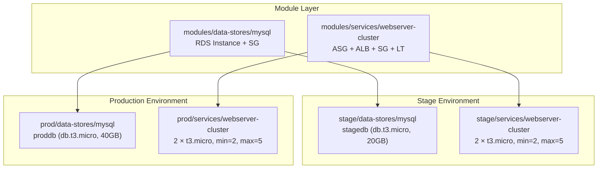

# Deployment Activity: Chapter 4 — Module Composition

## Status: ✅ Deployed & Verified — ⚠️ Not Yet Destroyed

## Goal
Learn **module composition** — combining multiple independent modules (webserver + database) into a complete infrastructure stack, deployed across multiple environments.

---

## Architecture



---

## What Was Deployed

### Step 1: Stage MySQL Database

| Resource | Value |
|---|---|
| DB Name | `stagedb` |
| Instance | `db.t3.micro` |
| Storage | 20 GB |
| Address | `stagedb.cyfu2uqcmt7d.us-east-1.rds.amazonaws.com` |
| Duration | ~8 min (DNS error recovery) |

### Step 2: Stage Webserver Cluster

| Resource | Value |
|---|---|
| ASG | `webserver-stage-asg` (min=2, max=5) |
| Instances | 2 × `t3.micro` at `98.93.224.198`, `54.209.241.146` |
| ALB | `webserver-stage-alb-993941447.us-east-1.elb.amazonaws.com` |
| Duration | ~3 min |

### Step 3: Prod MySQL Database

| Resource | Value |
|---|---|
| DB Name | `proddb` |
| Instance | `db.t3.micro` (changed from `db.t3.small` — free tier restriction) |
| Storage | 40 GB |
| Address | `proddb.cyfu2uqcmt7d.us-east-1.rds.amazonaws.com` |
| Duration | ~8 min (free tier fix + DNS error recovery) |

### Step 4: Prod Webserver Cluster

| Resource | Value |
|---|---|
| ASG | `webserver-prod-asg` (min=2, max=5) |
| Instances | 2 × `t3.micro` at `44.202.198.123`, `54.87.41.201` |
| ALB | `webserver-prod-alb-719954941.us-east-1.elb.amazonaws.com` |
| Duration | ~3 min + free tier fix |

---

## Bugs Fixed

| Bug | Root Cause | Fix |
|---|---|---|
| **DNS resolution failure** | Machine lost DNS for AWS endpoints during RDS creation | `terraform force-unlock` + `terraform untaint` + re-run |
| **Free tier: db.t3.small** | Free account can't launch `db.t3.small` | Changed to `db.t3.micro`, kept 40GB storage |
| **Free tier: t3.medium EC2** | Free account can't launch `t3.medium` | Changed to `t3.micro`, reduced ASG to min=2, max=5 |
| **user_data.tftpl missing** | Copied module file renamed from `.tftpl` to `.sh` | Renamed back to `user_data.tftpl` |

---

## Key Concepts Demonstrated

| Concept | How It Was Used |
|---|---|
| **Module composition** | Webserver module + MySQL module called from each environment |
| **Multi-environment** | Same modules, different `terraform.tfvars` per stage/prod |
| **Separate state files** | Each of 4 projects stores state at unique S3 key |
| **S3 backend** | All projects use `backend "s3" { ... }` with locking |
| **DB subnet groups** | Created in caller, passed to MySQL module |
| **Sensitive vars** | `db_password` marked `sensitive = true` |

---

## Key Takeaway

> **Modules are LEGO blocks for infrastructure — build once, compose into full stacks, deploy to any environment with different config.**

---

## ⚠️ Cost Warning

| Resource | Count | Est. Monthly Cost |
|---|---|---|
| EC2 t3.micro (stage) | 2 | ~$14 |
| EC2 t3.micro (prod) | 2 | ~$14 |
| RDS stagedb | 1 | ~$12 |
| RDS proddb | 1 | ~$12 |
| ALBs | 2 | ~$34 |
| **Total** | | **~$86/month** |

## Destroy to Stop Costs

```bash
cd chapter-4\prod\services\webserver-cluster && terraform destroy -auto-approve
cd chapter-4\prod\data-stores\mysql && terraform destroy -auto-approve
cd chapter-4\stage\services\webserver-cluster && terraform destroy -auto-approve
cd chapter-4\stage\data-stores\mysql && terraform destroy -auto-approve
cd chapter-3\00-bootstrap-s3 && terraform destroy -auto-approve
```
