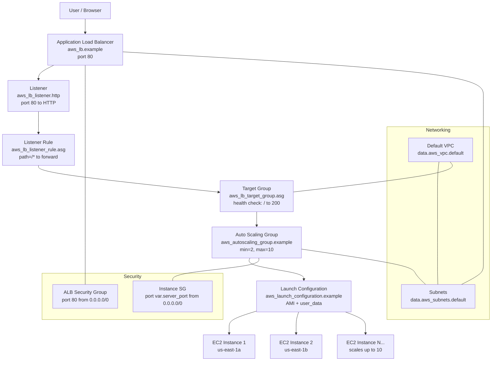

# Chapter 2: webserver-cluster — Auto Scaling Group + Load Balancer

## Overview

This plan implements the 4th and final sub-project from Chapter 2 of _Terraform: Up & Running_ (3rd Edition). We will create a **new directory** `webserver-cluster/` as a standalone Terraform project containing a production-grade architecture: an Auto Scaling Group (ASG) behind an Application Load Balancer (ALB).

The existing root directory (`main.tf` with the single EC2 instance) will be **destroyed first** to clean up running resources, then the root directory will serve as the repo root while `webserver-cluster/` becomes a new construct within the repo.

## Repository Structure After Implementation

```
terraform-aws-modules/
├── .gitignore
├── .terraform.lock.hcl
├── learning_strategy.md
├── lookups.tf
├── main.tf              ← will be emptied/removed after destroy
├── outputs.tf            ← will be emptied/removed after destroy
├── providers.tf          ← stays as root config
├── realworld-001.md
├── variables.tf          ← will be emptied/removed after destroy
├── plans/
│   └── chapter2-webserver-cluster-plan.md
└── webserver-cluster/    ← NEW: standalone Terraform project
    ├── main.tf           ← ASG + ALB + all resources
    ├── variables.tf      ← server_port, alb_name, sg names
    ├── outputs.tf        ← alb_dns_name
    └── providers.tf      ← same provider config as root
```

## Architecture Diagram



## New Concepts Introduced

| Concept                       | Resource                                           | Purpose                                                                                                                                       |
| ----------------------------- | -------------------------------------------------- | --------------------------------------------------------------------------------------------------------------------------------------------- |
| **Launch Configuration**      | `aws_launch_configuration.example`                 | A template that defines what each EC2 instance looks like (AMI, instance type, user_data, security groups). Like a "blueprint" for instances. |
| **Auto Scaling Group**        | `aws_autoscaling_group.example`                    | Automatically maintains a desired number of instances. If one crashes, it launches a replacement. Can scale up/down based on load.            |
| **Application Load Balancer** | `aws_lb.example`                                   | A single entry point (DNS name) that distributes incoming traffic across multiple EC2 instances.                                              |
| **Listener**                  | `aws_lb_listener.http`                             | Defines WHAT traffic the ALB accepts (port 80, HTTP protocol) and what to do by default (404 page).                                           |
| **Target Group**              | `aws_lb_target_group.asg`                          | A logical group of instances that the ALB forwards traffic to. Includes health check configuration.                                           |
| **Listener Rule**             | `aws_lb_listener_rule.asg`                         | Tells the ALB: "if the path matches `/*`, forward to the target group."                                                                       |
| **Data Sources**              | `data.aws_vpc.default`, `data.aws_subnets.default` | Queries AWS for existing resources (default VPC, its subnets) instead of creating new ones.                                                   |
| **Lifecycle Meta-Argument**   | `lifecycle { create_before_destroy = true }`       | Tells Terraform to create a new launch configuration BEFORE destroying the old one (zero-downtime deployment).                                |

## Step-by-Step Execution Plan

### Step 1: Destroy existing single EC2 instance

**Why:** The root directory's [`main.tf`](../main.tf) currently manages `aws_instance.app` and `aws_security_group.web`. We need to destroy these to stop incurring costs and clean up before creating the new cluster in a subdirectory.

**Command:**

```bash
cd /d C:\Users\T490\Documents\modulo-vault\terraform-aws-modules
terraform destroy -auto-approve
```

**Expected result:** EC2 instance `i-08bd5d1cf82f75a1d` and security group `sg-0f3bfe51e8452209f` are terminated.

---

### Step 2: Create `webserver-cluster/` directory

**Why:** The new cluster will be a standalone Terraform project in its own directory, with its own state file. This keeps it isolated from the root project.

```bash
mkdir webserver-cluster
```

---

### Step 3: Create `webserver-cluster/providers.tf`

**Content:** Same provider configuration as the root [`providers.tf`](../providers.tf) — region `us-east-1`, profile `terraform-in-depth`, AWS provider `~> 5.0`, Terraform `>= 1.0.0, < 2.0.0`.

```hcl
terraform {
  required_version = ">= 1.0.0, < 2.0.0"

  required_providers {
    aws = {
      source  = "hashicorp/aws"
      version = "~> 5.0"
    }
  }
}

provider "aws" {
  region  = "us-east-1"
  profile = "terraform-in-depth"
}
```

---

### Step 4: Create `webserver-cluster/variables.tf`

**Variables:**

| Variable                       | Type     | Default                      | Description                        |
| ------------------------------ | -------- | ---------------------------- | ---------------------------------- |
| `server_port`                  | `number` | `80`                         | The port the web server listens on |
| `alb_name`                     | `string` | `terraform-asg-example`      | The name of the ALB                |
| `instance_security_group_name` | `string` | `terraform-example-instance` | Name of the instance SG            |
| `alb_security_group_name`      | `string` | `terraform-example-alb`      | Name of the ALB SG                 |

---

### Step 5: Create `webserver-cluster/main.tf`

**10 resources total:**

| #   | Resource                           | Key Attributes                                                                                          |
| --- | ---------------------------------- | ------------------------------------------------------------------------------------------------------- |
| 1   | `data.aws_vpc.default`             | `default = true` — finds the default VPC                                                                |
| 2   | `data.aws_subnets.default`         | Filters by VPC ID — finds all subnets                                                                   |
| 3   | `aws_security_group.instance`      | Inbound on `var.server_port` from anywhere                                                              |
| 4   | `aws_security_group.alb`           | Inbound port 80, all outbound                                                                           |
| 5   | `aws_launch_configuration.example` | AMI `ami-02fd066b86800f60c`, `t3.micro`, Apache user_data, `lifecycle { create_before_destroy = true }` |
| 6   | `aws_autoscaling_group.example`    | Launch config, subnets, target group, min=2, max=10                                                     |
| 7   | `aws_lb.example`                   | ALB, internet-facing, subnets, ALB SG                                                                   |
| 8   | `aws_lb_listener.http`             | Port 80, default 404                                                                                    |
| 9   | `aws_lb_target_group.asg`          | HTTP on `var.server_port`, health check `/`                                                             |
| 10  | `aws_lb_listener_rule.asg`         | Path `/*` → forward to target group                                                                     |

**Key differences from the book's code:**

- Use `t3.micro` instead of `t2.micro` (free-tier eligible)
- Use `us-east-1` AMI (`ami-02fd066b86800f60c`) instead of `us-east-2` AMI
- Use Apache (`apt-get install apache2`) instead of `busybox httpd`
- Use our profile (`terraform-in-depth`) instead of default credentials

**Apache user_data:**

```bash
#!/bin/bash
sudo apt-get update
sudo apt-get install -y apache2
sudo systemctl start apache2
sudo systemctl enable apache2
echo "Hello from instance $(hostname -f)" > /var/www/html/index.html
```

The `$(hostname -f)` in index.html lets us verify which instance serves each request when we refresh the browser.

---

### Step 6: Create `webserver-cluster/outputs.tf`

```hcl
output "alb_dns_name" {
  value       = aws_lb.example.dns_name
  description = "The domain name of the load balancer"
}
```

---

### Step 7: `terraform init` + `terraform plan` in `webserver-cluster/`

```bash
cd /d C:\Users\T490\Documents\modulo-vault\terraform-aws-modules\webserver-cluster
terraform init
terraform plan
```

**Expected plan output:** 10 resources to add (2 data sources + 8 managed resources).

---

### Step 8: `terraform apply`

```bash
terraform apply -auto-approve
```

**Expected result:**

- Default VPC and subnets discovered (data sources, no cost)
- Two security groups created
- Launch configuration created
- ALB created (takes 1-2 minutes to provision)
- Target group + listener + rule created
- Auto Scaling Group created → launches 2 EC2 instances

**Cost:** 2 `t3.micro` instances = ~$0.0416/hour total.

---

### Step 9: Test the ALB

Get the DNS name:

```bash
terraform output alb_dns_name
```

Or via AWS CLI:

```bash
aws elbv2 describe-load-balancers --names terraform-asg-example --profile terraform-in-depth --region us-east-1 --query "LoadBalancers[0].DNSName" --output text
```

Open `http://<alb-dns-name>` in browser. You should see:

- **Success:** `"Hello from instance ip-xxx"` — the hostname changes on refresh as the ALB routes to different instances
- **Failure:** 404 page (if listener rule isn't matching) or timeout (if security groups are wrong)

---

### Step 10: Commit and push to GitHub

```bash
cd /d C:\Users\T490\Documents\modulo-vault\terraform-aws-modules
git add .
git commit -m "feat: add webserver-cluster with ASG and ALB"
git push
```

---

## What You'll Learn

After completing this, you will have hands-on experience with:

1. **Data Sources** — Querying AWS for existing resources (VPCs, subnets)
2. **Launch Configurations** — Defining instance templates
3. **Auto Scaling Groups** — Running multiple instances with automatic healing
4. **Application Load Balancers** — Distributing traffic across instances
5. **Target Groups & Health Checks** — Ensuring only healthy instances receive traffic
6. **Listener Rules** — Path-based routing
7. **Lifecycle Meta-Arguments** — Controlling creation/destruction order
8. **Multi-instance Architecture** — How production web apps are actually deployed
9. **Multi-directory Terraform projects** — Organizing infrastructure into separate constructs

## Verification Checklist

- [ ] `terraform destroy` succeeds in root (old single instance removed)
- [ ] `webserver-cluster/` directory created with 4 files
- [ ] `terraform init` in `webserver-cluster/` succeeds
- [ ] `terraform plan` shows 10 resources to create
- [ ] `terraform apply` completes without errors
- [ ] ALB DNS name is output
- [ ] Browser shows "Hello from instance ip-xxx" (alternating on refresh)
- [ ] `terraform destroy` in `webserver-cluster/` cleans up all resources when done
