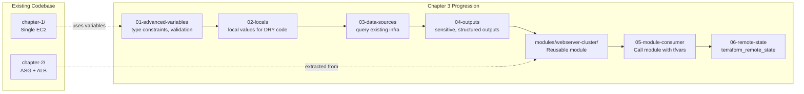
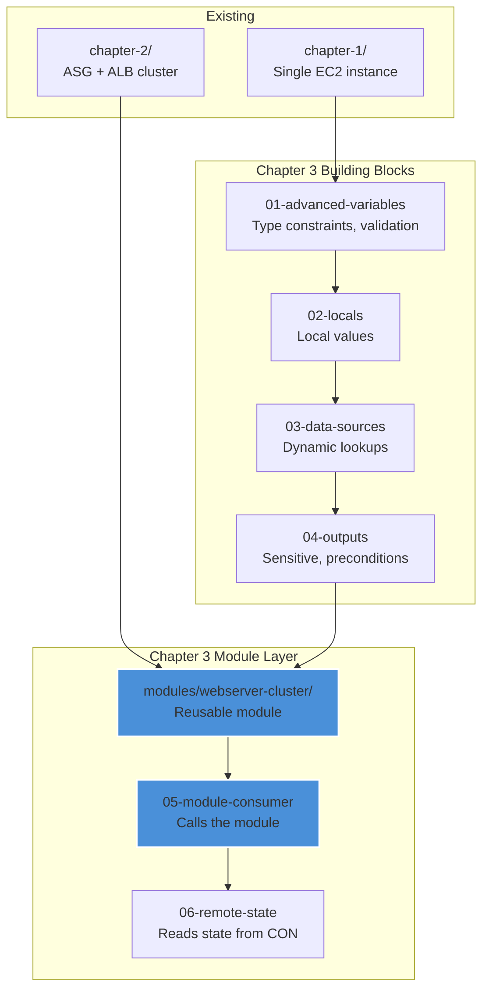

# Chapter 3: Variables, Locals, Data Sources, Outputs & Modules

## Overview

Chapter 3 focuses on making Terraform code **reusable and composable**. While Chapter 2 introduced basic variables, Chapter 3 deepens that knowledge with **advanced variable patterns**, **local values**, **data sources**, **rich outputs**, and most importantly — **custom modules**.

Following the existing pattern (`chapter-1/` for basics, `chapter-2/` for networking/scaling), Chapter 3 will be organized as a **parent directory** with multiple independent sub-projects, each demonstrating a specific concept. This creates a clean progression where each example builds on the previous one.

---

## Goals

1. Understand **advanced variable features** (type constraints, validation, sensitive, nullable)
2. Use **local values** (`locals`) to keep configurations DRY
3. Master **data sources** for querying existing infrastructure
4. Implement **rich output patterns** (sensitive outputs, conditional outputs)
5. Extract the Chapter 2 cluster into a **reusable module**
6. Understand **remote state** with `terraform_remote_state` data source

---

## Proposed Directory Structure

```
terraform-aws-modules/
├── chapter-1/                          # ✅ Existing — Single EC2 instance
├── chapter-2/                          # ✅ Existing — ASG + ALB cluster
├── chapter-3/                          # 🆕 NEW — Variables, Locals, Outputs & Modules
│   ├── 01-advanced-variables/          # Advanced variable features
│   │   ├── main.tf
│   │   ├── variables.tf
│   │   ├── outputs.tf
│   │   ├── providers.tf
│   │   └── terraform.tfvars
│   ├── 02-locals/                      # local values for DRY code
│   │   ├── main.tf
│   │   ├── variables.tf
│   │   ├── outputs.tf
│   │   └── providers.tf
│   ├── 03-data-sources/                # Querying existing AWS infrastructure
│   │   ├── main.tf
│   │   ├── variables.tf
│   │   ├── outputs.tf
│   │   └── providers.tf
│   ├── 04-outputs/                     # Advanced output patterns
│   │   ├── main.tf
│   │   ├── variables.tf
│   │   ├── outputs.tf
│   │   └── providers.tf
│   ├── modules/
│   │   └── webserver-cluster/          # Reusable module extracted from Chapter 2
│   │       ├── main.tf
│   │       ├── variables.tf
│   │       └── outputs.tf
│   ├── 05-module-consumer/             # Uses the webserver-cluster module
│   │   ├── main.tf
│   │   ├── variables.tf
│   │   ├── outputs.tf
│   │   ├── providers.tf
│   │   └── terraform.tfvars
│   └── 06-remote-state/                # terraform_remote_state data source demo
│       ├── main.tf
│       ├── variables.tf
│       ├── outputs.tf
│       └── providers.tf
├── docs/
│   ├── learning_strategy.md
│   ├── realworld-001.md
│   ├── realworld-002.md
│   └── plans/
│       ├── chapter2-webserver-cluster-plan.md
│       └── chapter3-plan.md            # 🆕 This file
```

---

## Architecture & Concept Flow



---

## Step-by-Step Execution Plan

### Step 1: Create Chapter 3 directory scaffolding

Create the parent `chapter-3/` directory and all sub-project directories:

```bash
mkdir -p chapter-3/{01-advanced-variables,02-locals,03-data-sources,04-outputs,modules/webserver-cluster,05-module-consumer,06-remote-state}
```

**Why:** Establishes the workspace structure before writing any code.

---

### Step 2: `01-advanced-variables` — Advanced Variable Features

**Purpose:** Demonstrate Terraform's rich variable type system — something Chapter 2 only touched lightly.

**Key concepts from the book:**

- Type constraints: `string`, `number`, `bool`, `list(<type>)`, `map(<type>)`, `set(<type>)`, `object({})`, `tuple([])`
- `validation` blocks — input validation rules
- `sensitive = true` — mark variables as sensitive
- `nullable` — allow null values
- `default` values and `terraform.tfvars`

**Resources created:** Simple AWS resources (e.g., a single EC2 instance or S3 bucket) demonstrating each concept.

**File: [`chapter-3/01-advanced-variables/variables.tf`](chapter-3/01-advanced-variables/variables.tf)**

```hcl
variable "instance_type" {
  description = "EC2 instance type"
  type        = string
  default     = "t3.micro"

  validation {
    condition     = contains(["t2.micro", "t3.micro", "t3.small", "t3.medium"], var.instance_type)
    error_message = "Instance type must be a free-tier eligible type."
  }
}

variable "tags" {
  description = "Tags to apply to all resources"
  type        = map(string)
  default = {
    Environment = "learning"
    Chapter     = "03-advanced-variables"
  }
}

variable "security_group_rules" {
  description = "List of ingress rules"
  type = list(object({
    port        = number
    protocol    = string
    cidr_blocks = list(string)
  }))
  default = [
    { port = 80, protocol = "tcp", cidr_blocks = ["0.0.0.0/0"] },
    { port = 443, protocol = "tcp", cidr_blocks = ["0.0.0.0/0"] },
  ]
}

variable "db_password" {
  description = "Database password"
  type        = string
  sensitive   = true
}
```

**Verification:** `terraform plan` shows that invalid instance types are rejected by the validation block.

---

### Step 3: `02-locals` — Local Values for DRY Code

**Purpose:** Demonstrate how `locals` simplifies repeated expressions and makes code cleaner.

**Key concepts:**

- `locals { ... }` block for computed values
- Referencing locals with `local.<name>`
- Combining variables and data sources into local values

**Resources created:** Simple AWS resources using locals for naming, tagging, and computed values.

**File: [`chapter-3/02-locals/main.tf`](chapter-3/02-locals/main.tf)** (illustrative)

```hcl
locals {
  # Computed naming
  name_prefix = "terraform-in-depth-${var.environment}"

  # Merged tags: base tags + environment-specific tags
  common_tags = merge(var.base_tags, {
    Name        = "${local.name_prefix}-server"
    Environment = var.environment
    ManagedBy   = "Terraform"
  })

  # Conditional AMI lookup logic
  ami_id = var.custom_ami != null ? var.custom_ami : data.aws_ami.ubuntu.id
}
```

**Verification:** `terraform plan` shows all resources using the computed local values correctly.

---

### Step 4: `03-data-sources` — Querying Existing AWS Infrastructure

**Purpose:** Deep-dive into data sources beyond the simple VPC/subnet lookups in Chapter 2.

**Key concepts:**

- `data.aws_ami` — find the latest AMI
- `data.aws_availability_zones` — list available AZs
- `data.aws_caller_identity` — get current AWS account info
- `data.aws_region` — get current region
- Filtering and sorting data sources

**Resources created:** A server that uses dynamic data source lookups for its configuration.

**Verification:** `terraform output` displays the discovered account ID, region, latest AMI ID, and available AZs.

---

### Step 5: `04-outputs` — Advanced Output Patterns

**Purpose:** Go beyond simple outputs and demonstrate production-quality output patterns.

**Key concepts:**

- `description` — always document outputs
- `sensitive = true` — hide sensitive values from CLI
- `precondition` blocks — validate outputs
- `output` with `for` expressions for transformation
- Structured outputs (objects + maps)

**Verification:** `terraform output` shows the different output behaviors (sensitive hidden, preconditions checked).

---

### Step 6: Extract `modules/webserver-cluster/` from Chapter 2

**Purpose:** This is the **core of Chapter 3**. We refactor the Chapter 2 cluster code into a **reusable module**.

**Key concepts:**

- Module structure: `main.tf`, `variables.tf`, `outputs.tf` (no `providers.tf` or `terraform {}` block in modules)
- Module inputs via `variables.tf`
- Module outputs via `outputs.tf`
- `source` path references
- Module versioning patterns

**What to extract from [`chapter-2/`](chapter-2/):**

| Chapter 2 File | Module File                              | Changes                                                                  |
| -------------- | ---------------------------------------- | ------------------------------------------------------------------------ |
| `main.tf`      | `modules/webserver-cluster/main.tf`      | Remove `providers.tf` content; keep all resources as-is                  |
| `variables.tf` | `modules/webserver-cluster/variables.tf` | Add more variables for flexibility (vpc_id, subnets, ami, instance_type) |
| `outputs.tf`   | `modules/webserver-cluster/outputs.tf`   | Add more outputs (asg_name, sg_ids, listener_arn)                        |

**Module variables (expanded from Chapter 2):**

```hcl
variable "cluster_name" {
  description = "Name prefix for all resources in the cluster"
  type        = string
}

variable "ami" {
  description = "AMI ID to use for EC2 instances. If null, uses latest Ubuntu 22.04"
  type        = string
  default     = null
}

variable "instance_type" {
  description = "EC2 instance type"
  type        = string
  default     = "t3.micro"
}

variable "server_port" {
  description = "Port the web server listens on"
  type        = number
  default     = 80
}

variable "min_size" {
  description = "Minimum number of instances in the ASG"
  type        = number
  default     = 2
}

variable "max_size" {
  description = "Maximum number of instances in the ASG"
  type        = number
  default     = 10
}

variable "vpc_id" {
  description = "VPC ID to deploy into"
  type        = string
}

variable "subnet_ids" {
  description = "List of subnet IDs to deploy into"
  type        = list(string)
}
```

**Important:** Modules **do not** include `provider` or `terraform` required_version blocks (with rare exceptions). The provider configuration is inherited from the calling root module.

---

### Step 7: `05-module-consumer` — Using the Module

**Purpose:** Demonstrate consuming the reusable module from a root module, passing in variables via `terraform.tfvars`.

**File: [`chapter-3/05-module-consumer/main.tf`](chapter-3/05-module-consumer/main.tf)**

```hcl
module "webserver_cluster" {
  source = "../modules/webserver-cluster"

  cluster_name  = "terraform-module-demo"
  instance_type = "t3.micro"
  min_size      = 2
  max_size      = 5
  server_port   = 80

  # Pass in data source lookups from the root module
  vpc_id     = data.aws_vpc.default.id
  subnet_ids = data.aws_subnets.default.ids
}
```

**Key concepts:**

- Module `source` paths (`../modules/webserver-cluster`)
- Module inputs passed from root module variables/data
- Module outputs consumed as `module.webserver_cluster.alb_dns_name`
- `terraform init` downloads/locates modules

**`terraform.tfvars`:**

```hcl
cluster_name  = "terraform-module-demo"
instance_type = "t3.micro"
min_size      = 2
max_size      = 5
```

**Verification:** `terraform plan` shows all resources from the module as "module.webserver*cluster.aws*..." prefixed resources.

---

### Step 8: `06-remote-state` — `terraform_remote_state` Data Source

**Purpose:** Demonstrate how to read outputs from one Terraform project's state from another project.

**Key concepts:**

- `terraform_remote_state` data source
- Sharing outputs across Terraform projects
- Dependency ordering between projects

**Note:** This step requires first having a remote backend configured (S3 + DynamoDB). If the user hasn't configured a remote backend yet, this step introduces that concept.

**File: [`chapter-3/06-remote-state/main.tf`](chapter-3/06-remote-state/main.tf)**

```hcl
data "terraform_remote_state" "cluster" {
  backend = "s3"

  config = {
    bucket = var.remote_state_bucket
    key    = var.remote_state_key
    region = var.remote_state_region
  }
}

# Use the ALB DNS name from the module consumer's state
output "cluster_alb_dns" {
  value = data.terraform_remote_state.cluster.outputs.alb_dns_name
}
```

**Verification:** `terraform plan` successfully reads outputs from another project's state file.

---

### Step 9: Create `docs/realworld-003.md`

**Purpose:** Following the pattern of `realworld-001.md` and `realworld-002.md`, document what Chapter 3 teaches in real-world terms — the business value of reusable modules, DRY code with locals, and sharing state between projects.

**Topics to cover:**

- **Modules = Infrastructure LEGO blocks** — How companies build a library of reusable infrastructure components
- **Why modules matter** — The DRY principle applied to infrastructure (Spotify's module registry, Netflix's Spinnaker integration)
- **Real-world module patterns** — VPC modules, database modules, Kubernetes cluster modules
- **State sharing** — How microservices teams use `terraform_remote_state` to discover each other's infrastructure

---

## New Concepts Introduced

| Concept                    | Resource / Syntax                                         | Purpose                                                             |
| -------------------------- | --------------------------------------------------------- | ------------------------------------------------------------------- |
| **Type Constraints**       | `type = list(object({...}))`                              | Define complex, nested variable types beyond simple strings/numbers |
| **Validation**             | `validation { condition = ... }`                          | Reject invalid inputs at plan time instead of apply time            |
| **Sensitive**              | `sensitive = true`                                        | Prevent secrets from appearing in CLI output and logs               |
| **Local Values**           | `locals { ... }`                                          | Compute reusable values without repeating complex expressions       |
| **Data Sources**           | `data.aws_ami.ubuntu`, `data.aws_caller_identity.current` | Query AWS for existing resources dynamically                        |
| **Preconditions**          | `precondition { ... }` in outputs                         | Validate output values before they're displayed                     |
| **Modules**                | `module "name" { source = "..." }`                        | Package reusable infrastructure into composable units               |
| **Module Structure**       | `modules/<name>/main.tf` + `variables.tf` + `outputs.tf`  | The standard file structure for Terraform modules                   |
| **terraform_remote_state** | `data "terraform_remote_state" "name"`                    | Read outputs from another Terraform project's state                 |
| **tfvars**                 | `terraform.tfvars`                                        | Separate variable values from variable declarations                 |

---

## What You'll Learn

After completing Chapter 3, you will have hands-on experience with:

1. **Advanced variable declarations** — type constraints, validation rules, sensitive values
2. **Local values** — computing reusable expressions with `locals`
3. **Data sources** — querying AMIs, account info, regions, and more
4. **Production-grade outputs** — sensitive, preconditions, structured values
5. **Creating reusable modules** — extracting infrastructure into composable units
6. **Consuming modules** — passing variables, using outputs
7. **Module composition** — building complex infrastructure from smaller modules
8. **Remote state sharing** — connecting Terraform projects via `terraform_remote_state`
9. **Project organization** — structuring a multi-module Terraform repository

---

## Verification Checklist

- [ ] `chapter-3/` directory created with all 7 sub-directories
- [ ] `01-advanced-variables/` — `terraform plan` rejects invalid variable inputs via validation
- [ ] `02-locals/` — `terraform apply` creates resources with computed local names/tags
- [ ] `03-data-sources/` — `terraform output` shows discovered AMI, account, region
- [ ] `04-outputs/` — `terraform output` correctly hides sensitive values
- [ ] `modules/webserver-cluster/` — module files extracted and functional
- [ ] `05-module-consumer/` — `terraform init` finds the local module; `terraform plan` shows module-prefixed resources
- [ ] `06-remote-state/` — reads outputs from another project's state (requires S3 backend)
- [ ] `docs/realworld-003.md` — real-world explanation document created

---

## Relationship to Existing Codebase



---

## Execution Order

| Step | Directory                    | Action                           | Estimated Files |
| ---- | ---------------------------- | -------------------------------- | --------------- |
| 1    | `chapter-3/`                 | Create directory scaffolding     | 0 files (mkdir) |
| 2    | `01-advanced-variables/`     | Write advanced variable demos    | 5 files         |
| 3    | `02-locals/`                 | Write locals demo                | 4 files         |
| 4    | `03-data-sources/`           | Write data source demos          | 4 files         |
| 5    | `04-outputs/`                | Write output pattern demos       | 4 files         |
| 6    | `modules/webserver-cluster/` | Extract + enhance from Chapter 2 | 3 files         |
| 7    | `05-module-consumer/`        | Write module consumer            | 5 files         |
| 8    | `06-remote-state/`           | Write remote state consumer      | 4 files         |
| 9    | `docs/realworld-003.md`      | Write real-world explanation     | 1 file          |
