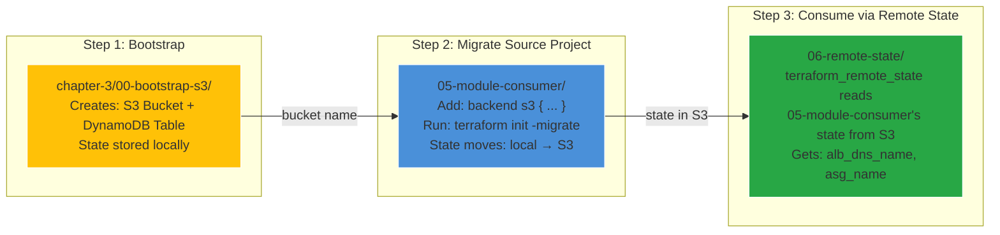

# Plan: Making `06-remote-state` Work End-to-End with S3

## Goal

Make `06-remote-state` actually functional by connecting it to real state stored in S3, matching the book's Chapter 3 approach.

## Problem

Currently `06-remote-state` has a `terraform_remote_state` data source pointing to S3, but no project actually stores its state there. The data source returns `"NOT FOUND"`.

## Solution: 3-Step Implementation



---

## Step 1: Create Bootstrap Project

**New directory:** `chapter-3/00-bootstrap-s3/`

### Files to create:

**`providers.tf`** — Same AWS config as all other projects.

**`main.tf`** — Creates:

- `aws_s3_bucket.terraform_state` — Versioned S3 bucket for state storage
- `aws_s3_bucket_versioning.enabled` — Enables versioning (track state history)
- `aws_dynamodb_table.terraform_locks` — State locking table (prevents concurrent operations)

**`outputs.tf`** — Exposes:

- `state_bucket_name` — The bucket name needed by other projects
- `state_bucket_arn` — For IAM policies
- `dynamodb_table_name` — The lock table name

### Commands:

```bash
terraform init
terraform apply -auto-approve
```

### Key consideration:

Bucket name must be globally unique. Pattern: `terraform-in-depth-state-{account_id}`.

---

## Step 2: Migrate `05-module-consumer` to S3 Backend

### File to modify:

**`05-module-consumer/providers.tf`** — Add `backend "s3" {}` block:

```hcl
terraform {
  backend "s3" {
    bucket         = "terraform-in-depth-state-{account_id}"
    key            = "05-module-consumer/terraform.tfstate"
    region         = "us-east-1"
    dynamodb_table = "terraform-in-depth-state-locks"
    encrypt        = true
  }
}
```

### Commands:

```bash
terraform init -migrate
```

Terraform will detect: "You have existing local state. You want S3. Copy it?" → Confirm `yes`.

### Verification:

```bash
terraform state list
```

Should show the same resources as before — state is intact, just stored in S3 now.

---

## Step 3: Configure and Run `06-remote-state`

### No code changes needed!

The `06-remote-state` project already has:

- [`data "terraform_remote_state" "cluster"`](chapter-3/06-remote-state/main.tf:16-24) reading from S3
- [`var.remote_state_bucket`](chapter-3/06-remote-state/variables.tf:6-9) for bucket name
- [`var.remote_state_key`](chapter-3/06-remote-state/variables.tf:11-14) defaulting to `terraform-module-demo/terraform.tfstate`

Just need to pass the right bucket name when running.

### Commands:

```bash
terraform init
terraform plan -var="remote_state_bucket=terraform-in-depth-state-{account_id}"
terraform apply -var="remote_state_bucket=terraform-in-depth-state-{account_id}"
```

### Expected output:

```
remote_alb_dns_name = "terraform-module-demo-alb-290524204.us-east-1.elb.amazonaws.com"
```

The ALB DNS name is **actually read from S3** — real cross-project state sharing.

---

## Files Changed Summary

| Action        | File                                        | Change Type                  |
| ------------- | ------------------------------------------- | ---------------------------- |
| **Create**    | `chapter-3/00-bootstrap-s3/providers.tf`    | New file                     |
| **Create**    | `chapter-3/00-bootstrap-s3/main.tf`         | New file                     |
| **Create**    | `chapter-3/00-bootstrap-s3/variables.tf`    | New file                     |
| **Create**    | `chapter-3/00-bootstrap-s3/outputs.tf`      | New file                     |
| **Modify**    | `chapter-3/05-module-consumer/providers.tf` | Add `backend "s3" {}` block  |
| **No change** | `chapter-3/06-remote-state/*`               | Already configured correctly |

---

## Order of Execution

| Step | Directory             | Command                   | Duration    |
| ---- | --------------------- | ------------------------- | ----------- |
| 1    | `00-bootstrap-s3/`    | `terraform apply`         | ~2 minutes  |
| 2    | `05-module-consumer/` | `terraform init -migrate` | ~30 seconds |
| 3    | `06-remote-state/`    | `terraform apply`         | ~30 seconds |

## Cleanup Order (reverse)

| Step | Directory             | Command                                                             |
| ---- | --------------------- | ------------------------------------------------------------------- |
| 1    | `06-remote-state/`    | `terraform destroy`                                                 |
| 2    | `05-module-consumer/` | First migrate back to local: `terraform init -migrate` then destroy |
| 3    | `00-bootstrap-s3/`    | `terraform destroy`                                                 |
