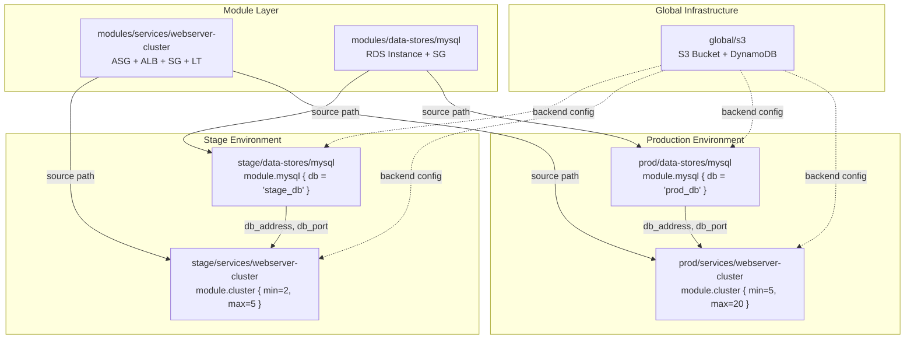
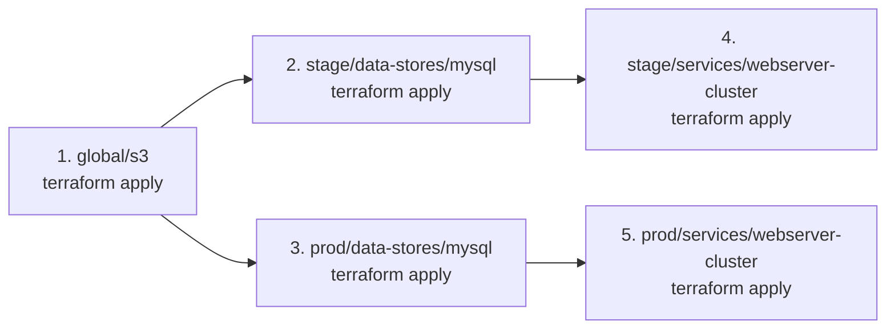

# Chapter 4: Reusing Infrastructure with Modules

## Overview

Chapter 4 introduces **module composition** — combining multiple independent modules to build a complete infrastructure stack. The book demonstrates two key patterns:

1. **Single-repo pattern** — modules and live config in the same repository
2. **Multi-repo pattern** — modules in one repo, live config in another

We will implement the **single-repo pattern** (same as the book's `module-example/`) and document the multi-repo pattern for reference.

---

## Proposed Directory Structure

```
chapter-4/
├── modules/
│   ├── services/
│   │   └── webserver-cluster/              ← Extracted from chapter-3/modules/
│   │       ├── main.tf                     ← ASG + ALB + SG + LT + Listener + TG
│   │       ├── variables.tf                ← cluster_name, ami, instance_type, vpc_id, subnet_ids, etc.
│   │       ├── outputs.tf                  ← alb_dns_name, asg_name, sg_ids
│   │       └── user-data.sh                ← Apache bootstrap script
│   └── data-stores/
│       └── mysql/                          ← 🆕 NEW: RDS MySQL module
│           ├── main.tf                     ← aws_db_instance + aws_security_group
│           ├── variables.tf                ← db_name, db_user, db_password, instance_class
│           └── outputs.tf                  ← db_address, db_port, db_endpoint
├── stage/
│   ├── data-stores/
│   │   └── mysql/                          ← Calls mysql module for staging
│   │       ├── main.tf                     ← module "mysql" { source = "../../../modules/data-stores/mysql" }
│   │       ├── outputs.tf                  ← db_address, db_port
│   │       └── terraform.tfvars            ← Stage-specific values
│   └── services/
│       └── webserver-cluster/              ← Calls webserver module for staging
│           ├── main.tf                     ← module "webserver_cluster" { source = "../../../modules/services/webserver-cluster" }
│           ├── outputs.tf                  ← alb_dns_name
│           └── terraform.tfvars            ← min_size=2, max_size=5
├── prod/
│   ├── data-stores/
│   │   └── mysql/                          ← Calls mysql module for production
│   │       ├── main.tf
│   │       ├── outputs.tf
│   │       └── terraform.tfvars            ← Prod-specific values
│   └── services/
│       └── webserver-cluster/              ← Calls webserver module for production
│           ├── main.tf
│           ├── outputs.tf
│           └── terraform.tfvars            ← min_size=5, max_size=20
├── global/
│   └── s3/                                 ← S3 backend (from chapter-3/00-bootstrap-s3)
│       ├── main.tf
│       └── outputs.tf
```

---

## Architecture Diagram



---

## File-by-File Detail

### Module: `modules/services/webserver-cluster/`

Extracted from [`chapter-3/modules/webserver-cluster/`](chapter-3/modules/webserver-cluster/) with minimal changes.

**File: [`main.tf`](chapter-4/modules/services/webserver-cluster/main.tf)**

- Same 8 resources as Chapter 3: SG (instance), SG (alb), LT, ASG, ALB, Listener, TG, Listener Rule
- Resources use `var.cluster_name` as prefix for all names
- Uses `templatefile()` for Apache bootstrap script

**File: [`variables.tf`](chapter-4/modules/services/webserver-cluster/variables.tf)**

```hcl
variable "cluster_name"  { type = string }
variable "ami"           { type = string }
variable "instance_type" { type = string; default = "t3.micro" }
variable "server_port"   { type = number; default = 80 }
variable "min_size"      { type = number; default = 2 }
variable "max_size"      { type = number; default = 10 }
variable "vpc_id"        { type = string }
variable "subnet_ids"    { type = list(string) }
variable "tags"          { type = map(string); default = {} }
```

**File: [`outputs.tf`](chapter-4/modules/services/webserver-cluster/outputs.tf)**

```hcl
output "alb_dns_name"           { value = aws_lb.example.dns_name }
output "alb_arn"                { value = aws_lb.example.arn }
output "alb_zone_id"            { value = aws_lb.example.zone_id }
output "asg_name"               { value = aws_autoscaling_group.example.name }
output "instance_sg_id"         { value = aws_security_group.instance.id }
output "alb_sg_id"              { value = aws_security_group.alb.id }
```

---

### Module: `modules/data-stores/mysql/` — 🆕 NEW

**File: [`main.tf`](chapter-4/modules/data-stores/mysql/main.tf)**

```hcl
# Security group allowing MySQL access from the webserver SG
resource "aws_security_group" "mysql" {
  name_prefix = "${var.db_name}-mysql-sg-"
  description = "Security group for MySQL database"

  ingress {
    from_port       = 3306
    to_port         = 3306
    protocol        = "tcp"
    security_groups = var.webserver_sg_ids  # Passed from caller
  }

  egress {
    from_port   = 0
    to_port     = 0
    protocol    = "-1"
    cidr_blocks = ["0.0.0.0/0"]
  }

  tags = var.tags
}

# RDS MySQL instance
resource "aws_db_instance" "mysql" {
  identifier     = var.db_name
  db_name        = var.db_name
  username       = var.db_user
  password       = var.db_password
  engine         = "mysql"
  engine_version = var.engine_version
  instance_class = var.instance_class
  allocated_storage     = var.allocated_storage
  skip_final_snapshot   = var.skip_final_snapshot
  publicly_accessible   = false
  vpc_security_group_ids = [aws_security_group.mysql.id]
  db_subnet_group_name   = var.db_subnet_group_name

  tags = var.tags
}
```

**File: [`variables.tf`](chapter-4/modules/data-stores/mysql/variables.tf)**

```hcl
variable "db_name"              { type = string }
variable "db_user"              { type = string }
variable "db_password"          { type = string; sensitive = true }
variable "instance_class"       { type = string; default = "db.t3.micro" }
variable "allocated_storage"    { type = number; default = 20 }
variable "engine_version"       { type = string; default = "8.0" }
variable "skip_final_snapshot"  { type = bool; default = true }   # Learning only
variable "db_subnet_group_name" { type = string }
variable "webserver_sg_ids"     { type = list(string); default = [] }
variable "tags"                 { type = map(string); default = {} }
```

**File: [`outputs.tf`](chapter-4/modules/data-stores/mysql/outputs.tf)**

```hcl
output "db_address"  { value = aws_db_instance.mysql.address }
output "db_port"     { value = aws_db_instance.mysql.port }
output "db_endpoint" { value = "${aws_db_instance.mysql.address}:${aws_db_instance.mysql.port}" }
output "db_sg_id"    { value = aws_security_group.mysql.id }
```

---

### Caller: `stage/services/webserver-cluster/`

**File: [`main.tf`](chapter-4/stage/services/webserver-cluster/main.tf)**

```hcl
terraform {
  backend "s3" {
    bucket  = "acme-state-bucket"
    key     = "stage/webserver-cluster/terraform.tfstate"
    region  = "us-east-1"
    profile = "company-profile"
  }
}

provider "aws" {
  region  = "us-east-1"
  profile = "company-profile"
}

data "aws_vpc" "default" { default = true }
data "aws_subnets" "default" {
  filter {
    name   = "vpc-id"
    values = [data.aws_vpc.default.id]
  }
}
data "aws_ami" "ubuntu" {
  most_recent = true
  owners      = ["099720109477"]
  filter {
    name   = "name"
    values = ["ubuntu/images/hvm-ssd/ubuntu-jammy-22.04-amd64-server-*"]
  }
  filter {
    name   = "virtualization-type"
    values = ["hvm"]
  }
}

module "webserver_cluster" {
  source       = "../../../modules/services/webserver-cluster"
  cluster_name = var.cluster_name
  ami          = data.aws_ami.ubuntu.id
  instance_type = var.instance_type
  server_port  = var.server_port
  min_size     = var.min_size
  max_size     = var.max_size
  vpc_id       = data.aws_vpc.default.id
  subnet_ids   = data.aws_subnets.default.ids
  tags = { Environment = "staging", Chapter = "04-modules" }
}
```

**File: [`terraform.tfvars`](chapter-4/stage/services/webserver-cluster/terraform.tfvars)**

```hcl
cluster_name  = "webserver-stage"
instance_type = "t3.micro"
server_port   = 80
min_size      = 2
max_size      = 5
```

---

### Caller: `prod/services/webserver-cluster/`

Same structure as stage, but with different `terraform.tfvars`:

```hcl
cluster_name  = "webserver-prod"
instance_type = "t3.medium"
server_port   = 80
min_size      = 5
max_size      = 20
```

---

### Caller: `stage/data-stores/mysql/`

**File: [`main.tf`](chapter-4/stage/data-stores/mysql/main.tf)**

```hcl
terraform {
  backend "s3" { ... }
}

provider "aws" { ... }

data "aws_vpc" "default" { default = true }
data "aws_subnets" "default" { ... }

resource "aws_db_subnet_group" "mysql" {
  name       = "${var.db_name}-subnet-group"
  subnet_ids = data.aws_subnets.default.ids
}

module "mysql" {
  source               = "../../../modules/data-stores/mysql"
  db_name              = var.db_name
  db_user              = var.db_user
  db_password          = var.db_password
  instance_class       = var.instance_class
  db_subnet_group_name = aws_db_subnet_group.mysql.name
  tags = { Environment = "staging" }
}
```

**File: [`terraform.tfvars`](chapter-4/stage/data-stores/mysql/terraform.tfvars)**

```hcl
db_name       = "stagedb"
db_user       = "admin"
db_password   = "StagePassword123!"  # Change before apply
instance_class = "db.t3.micro"
```

---

### Caller: `prod/data-stores/mysql/`

Same structure, different `.tfvars`:

```hcl
db_name        = "proddb"
db_user        = "admin"
db_password    = "ProdPassword456!"  # Change before apply
instance_class = "db.t3.small"       # Larger for production
```

---

## File Count Summary

| Directory                             | Files  | New                      |
| ------------------------------------- | ------ | ------------------------ |
| `modules/services/webserver-cluster/` | 4      | 0 (moved from chapter-3) |
| `modules/data-stores/mysql/`          | 3      | **3 new**                |
| `stage/data-stores/mysql/`            | 3      | **3 new**                |
| `stage/services/webserver-cluster/`   | 3      | **3 new**                |
| `prod/data-stores/mysql/`             | 3      | **3 new**                |
| `prod/services/webserver-cluster/`    | 3      | **3 new**                |
| `global/s3/`                          | 2      | 0 (moved from chapter-3) |
| **Total**                             | **21** | **15 new**               |

---

## New Concepts Introduced

| Concept                    | Where                                         | What It Teaches                                  |
| -------------------------- | --------------------------------------------- | ------------------------------------------------ |
| **Module composition**     | Calling both module types in same environment | Combining webserver + database into a full stack |
| **Data store module**      | `modules/data-stores/mysql/`                  | Infrastructure for databases (RDS)               |
| **Cross-module security**  | MySQL SG accepts traffic from webserver SG    | Passing SG IDs between modules                   |
| **Environment separation** | `stage/` vs `prod/` directories               | Same modules, different `.tfvars`                |
| **DB subnet group**        | Created in caller, passed to module           | Dependency management                            |
| **Sensitive passwords**    | Marked `sensitive = true`                     | Real-world secret handling                       |

---

## Execution Order



---

## What You'll Learn

After completing Chapter 4, you will have hands-on experience with:

1. **Module composition** — combining webserver + database modules into a full stack
2. **Multi-environment structure** — `stage/` vs `prod/` with different `.tfvars`
3. **Data store modules** — creating a reusable RDS MySQL module
4. **Cross-module security** — passing SG IDs between modules for least-privilege access
5. **Terraform backend per environment** — separate state files for stage and prod
6. **DB subnet groups** — networking for RDS in a VPC
7. **Sensitive variable handling** — database passwords in `.tfvars`
8. **Module versioning** — implicit via source path references

---

## Relationship to Book's Official Repo

| Book's `04-terraform-module/`                        | Our `chapter-4/`                                    | Status           |
| ---------------------------------------------------- | --------------------------------------------------- | ---------------- |
| `module-example/modules/services/webserver-cluster/` | `modules/services/webserver-cluster/`               | ✅ Mapped        |
| `module-example/modules/data-stores/mysql/`          | `modules/data-stores/mysql/`                        | 🆕 To create     |
| `module-example/stage/services/webserver-cluster/`   | `stage/services/webserver-cluster/`                 | 🆕 To create     |
| `module-example/prod/services/webserver-cluster/`    | `prod/services/webserver-cluster/`                  | 🆕 To create     |
| `module-example/stage/data-stores/mysql/`            | `stage/data-stores/mysql/`                          | 🆕 To create     |
| `module-example/prod/data-stores/mysql/`             | `prod/data-stores/mysql/`                           | 🆕 To create     |
| `multi-repo-example/`                                | Documented in `docs/patterns/multi-repo-pattern.md` | 📄 Documentation |

---

## Verification Checklist

- [ ] `modules/services/webserver-cluster/` exists with 4 files (moved from chapter-3)
- [ ] `modules/data-stores/mysql/` exists with 3 files
- [ ] `stage/data-stores/mysql/` — `terraform plan` succeeds
- [ ] `stage/services/webserver-cluster/` — `terraform plan` succeeds
- [ ] `prod/data-stores/mysql/` — `terraform plan` succeeds
- [ ] `prod/services/webserver-cluster/` — `terraform plan` succeeds
- [ ] Stage and prod use **different state files** in S3
- [ ] Stage webserver can reference stage mysql outputs via variables
- [ ] `terraform destroy` cleans up all resources in reverse order
