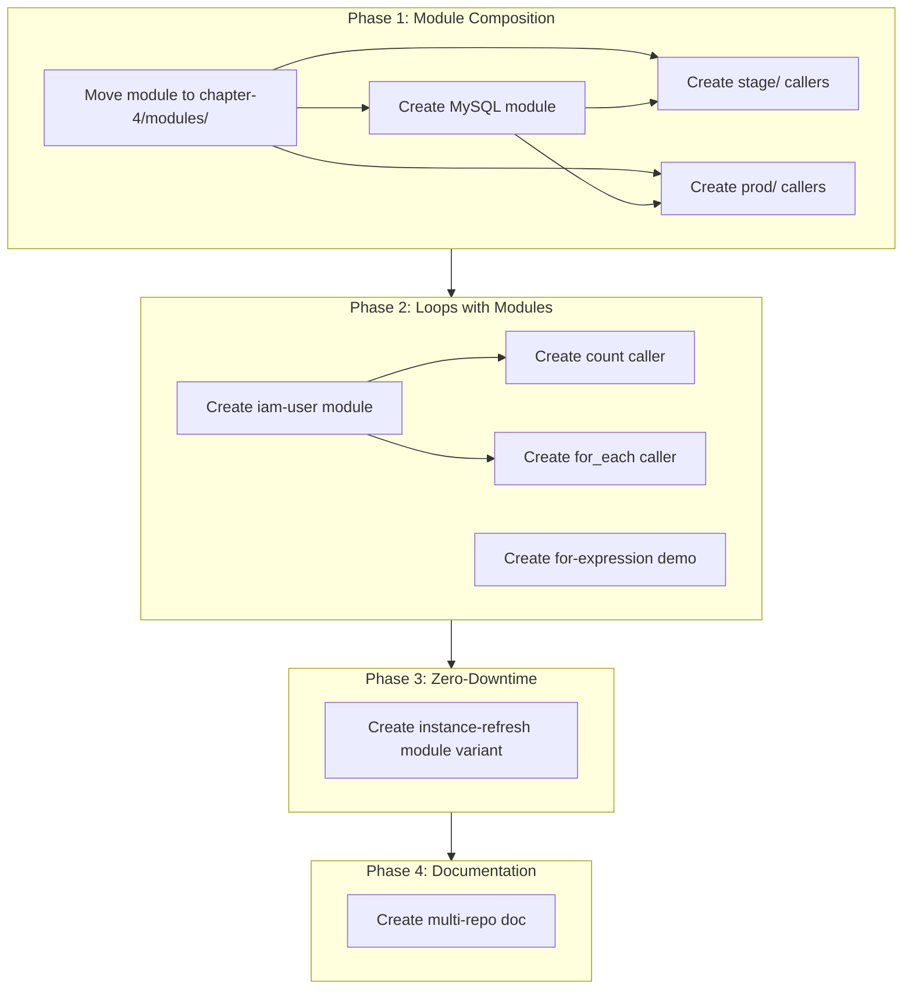

# Plan: Closing Module Gaps (Future — Chapters 4 & 5)

## ⚠️ Scope Note: This is NOT Chapter 3 content

The gaps documented here belong to **Chapters 4 and 5** of _Terraform: Up & Running_.

- **Chapter 4**: Reusing Infrastructure with Modules (MySQL module, multi-environment, multi-repo)
- **Chapter 5**: Tips & Tricks (loops with modules, zero-downtime deployment)

**Our `chapter-3/modules/webserver-cluster/` is complete and sufficient for Chapter 3.**
No changes needed to Chapter 3. This plan is saved for future implementation.

## Current State (Chapter 3 is ✅ Complete)

We have **1 module**: `chapter-3/modules/webserver-cluster/` — a reusable ASG + ALB blueprint.

The official book repo has **5+ modules** across chapters 4, 5, and 7. This plan documents those gaps for future implementation.

---

## Gap 1: MySQL / Data Stores Module — "Module Composition"

### What the book does

Creates an RDS MySQL module, then calls it from both `stage/` and `prod/` environments alongside the webserver module. This demonstrates **module composition** — combining independent modules into a full stack.

### Proposed structure

```
chapter-4/
├── modules/
│   ├── webserver-cluster/              ← Already exists, move here
│   └── data-stores/
│       └── mysql/                      ← NEW: RDS MySQL module
│           ├── main.tf                 ← aws_db_instance + SG
│           ├── variables.tf            ← db_name, db_user, db_password, instance_class
│           └── outputs.tf              ← db_address, db_port, db_endpoint
├── stage/
│   ├── data-stores/
│   │   └── mysql/
│   │       ├── main.tf                 ← module "mysql" { source = "../../../modules/data-stores/mysql" }
│   │       ├── variables.tf
│   │       └── terraform.tfvars
│   └── services/
│       └── webserver-cluster/
│           ├── main.tf                 ← module "webserver_cluster" { source = "../../../modules/webserver-cluster" }
│           └── terraform.tfvars        ← min_size = 2, max_size = 5
├── prod/
│   ├── data-stores/
│   │   └── mysql/                      ← Same module, different vars
│   └── services/
│       └── webserver-cluster/          ← Same module, different vars
│           └── terraform.tfvars        ← min_size = 3, max_size = 20
└── global/
    └── s3/                             ← Bootstrapped S3 backend
```

### Module variables

```hcl
# chapter-4/modules/data-stores/mysql/variables.tf
variable "db_name"     { type = string }
variable "db_user"     { type = string }
variable "db_password" { type = string; sensitive = true }
variable "instance_class" { type = string; default = "db.t3.micro" }  # Free tier
variable "allocated_storage" { type = number; default = 20 }
variable "engine_version" { type = string; default = "8.0" }
variable "skip_final_snapshot" { type = bool; default = true }  # Learning only
```

### Module outputs

```hcl
output "db_address"  { value = aws_db_instance.mysql.address }
output "db_port"     { value = aws_db_instance.mysql.port }
output "db_endpoint" { value = "${aws_db_instance.mysql.address}:${aws_db_instance.mysql.port}" }
```

### Key concepts demonstrated

- Module composition (webserver + database as a full stack)
- Same module called from `stage/` vs `prod/` with different `terraform.tfvars`
- Sensitive variable handling for passwords

### Duration estimate

- 4 new files for the module + 6 files for stage/prod callers = **10 files total**

---

## Gap 2: Multi-Environment Directory Structure

### What the book does

Instead of one consumer (`05-module-consumer/`), the book creates `stage/` and `prod/` directories that each call modules. The modules are stored in a `modules/` directory and referenced by path.

### Our adaptation

Move `chapter-3/modules/webserver-cluster/` to `chapter-4/modules/webserver-cluster/` and create two callers:

```
chapter-4/
├── modules/
│   └── webserver-cluster/           ← Moved from chapter-3
├── stage/
│   └── services/
│       └── webserver-cluster/
│           ├── main.tf              ← Calls module with stage defaults
│           ├── data.tf              ← AWS data lookups
│           └── terraform.tfvars     ← min_size = 2, max_size = 5
└── prod/
    └── services/
        └── webserver-cluster/
            ├── main.tf              ← Calls module with prod defaults
            ├── data.tf              ← AWS data lookups
            └── terraform.tfvars     ← min_size = 5, max_size = 20
```

### Key differences between stage and prod

| Variable        | Stage      | Prod         |
| --------------- | ---------- | ------------ |
| `min_size`      | 2          | 5            |
| `max_size`      | 5          | 20           |
| `instance_type` | `t3.micro` | `t3.medium`  |
| `server_port`   | 80         | 80           |
| `environment`   | `staging`  | `production` |

### Key concepts

- Terraform workspace-like pattern using directories
- Environment-specific configuration files
- Module versioning (source path references)

---

## Gap 3: Loops with Modules — count, for_each, for

### What the book demonstrates (Chapter 5)

The book's `05-tips-and-tricks` chapter shows multiple loop patterns:

| Pattern                  | File                               | What It Does                            |
| ------------------------ | ---------------------------------- | --------------------------------------- |
| `count` with resource    | `three-iam-users-increment-name/`  | Creates 3 IAM users using `count.index` |
| `for_each` with resource | `three-iam-users-for-each/`        | Creates IAM users from a `set(string)`  |
| `count` with module      | `three-iam-users-module-count/`    | Calls a module 3 times using `count`    |
| `for_each` with module   | `three-iam-users-module-for-each/` | Calls a module from a `map`             |
| `for` expressions        | `for-expressions/`                 | Transforms lists and maps               |
| String directives        | `string-directives/`               | Template conditionals                   |

### Proposed module

```hcl
# chapter-5/modules/landing-zone/iam-user/main.tf
resource "aws_iam_user" "this" {
  name = var.user_name
  path = var.path

  tags = var.tags
}
```

### Proposed callers

```hcl
# chapter-5/loops/three-iam-users-module-count/main.tf
module "iam_user" {
  source = "../../modules/landing-zone/iam-user"
  count    = 3
  user_name = "learning-user-${count.index}"
}

# chapter-5/loops/three-iam-users-module-for-each/main.tf
module "iam_user" {
  source   = "../../modules/landing-zone/iam-user"
  for_each = toset(["alice", "bob", "charlie"])
  user_name = "learning-${each.value}"
}
```

### Key concepts

- `count` — creates N instances of a module with numeric index
- `for_each` — creates instances from a set/map with string keys
- `for` expressions — transforms data structures
- `try()` / `can()` — error handling in expressions

---

## Gap 4: Zero-Downtime Deployment

### What the book demonstrates

The book's `05-tips-and-tricks/zero-downtime-deployment` section shows:

1. **Lifecycle `create_before_destroy`** — Already have this on SGs and LT
2. **ASG instance refresh** — New: use `aws_autoscaling_group` with `instance_refresh` to roll out new instances without downtime
3. **Listener rule priority management** — Blue/green deployment via listener rule weights

### Proposed enhancement to webserver-cluster module

Add to [`chapter-3/modules/webserver-cluster/main.tf`](chapter-3/modules/webserver-cluster/main.tf):

```hcl
resource "aws_autoscaling_group" "example" {
  # ... existing config ...

  instance_refresh {
    strategy = "Rolling"
    preferences {
      min_healthy_percentage = 50
    }
  }
}
```

Or create a new module variant:

```
chapter-5/modules/services/
├── webserver-cluster/                      ← Original (copy)
└── webserver-cluster-instance-refresh/     ← Enhanced with instance refresh
```

---

## Gap 5: Multi-Repo Pattern Documentation

### What the book demonstrates

The `04-terraform-module/multi-repo-example/` shows splitting modules and live config into separate Git repos:

```
modules/          ← Separate repo: terraform-aws-modules
└── services/
    └── webserver-cluster/

live/              ← Separate repo: terraform-live-config
├── prod/services/webserver-cluster/
└── stage/services/webserver-cluster/
```

### Our adaptation

Since we're learning in a single repo, we can document this pattern in a README rather than implement it. Create:

```
docs/patterns/multi-repo-pattern.md
```

Explaining:

- Why split modules from live config
- How to reference modules via Git URLs with version tags
- CI/CD implications

---

## Implementation Priority & Order

| Priority | Gap                                          | Files              | Concepts                                   | Difficulty |
| -------- | -------------------------------------------- | ------------------ | ------------------------------------------ | ---------- |
| 🥇 P0    | MySQL module + multi-env callers             | 10+ files          | Module composition, environment separation | Medium     |
| 🥇 P0    | Move existing module to `chapter-4/modules/` | Rename/restructure | Proper folder organization                 | Low        |
| 🥈 P1    | Loops with modules (IAM user)                | 8+ files           | count, for_each, for                       | Medium     |
| 🥉 P2    | Zero-downtime instance refresh               | 2 files modified   | Rolling updates                            | Low-Medium |
| 📄 P3    | Multi-repo pattern doc                       | 1 file             | Git workflow                               | Low        |

---

## Files Changed Summary

### Phase 1: Module Composition (P0)

| Action     | Path                                                          |
| ---------- | ------------------------------------------------------------- |
| **Rename** | `chapter-3/modules/` → `chapter-4/modules/`                   |
| **Create** | `chapter-4/modules/data-stores/mysql/main.tf`                 |
| **Create** | `chapter-4/modules/data-stores/mysql/variables.tf`            |
| **Create** | `chapter-4/modules/data-stores/mysql/outputs.tf`              |
| **Create** | `chapter-4/stage/data-stores/mysql/main.tf`                   |
| **Create** | `chapter-4/stage/data-stores/mysql/providers.tf`              |
| **Create** | `chapter-4/stage/data-stores/mysql/terraform.tfvars`          |
| **Create** | `chapter-4/stage/services/webserver-cluster/main.tf`          |
| **Create** | `chapter-4/stage/services/webserver-cluster/providers.tf`     |
| **Create** | `chapter-4/stage/services/webserver-cluster/terraform.tfvars` |
| **Create** | `chapter-4/prod/data-stores/mysql/main.tf`                    |
| **Create** | `chapter-4/prod/data-stores/mysql/providers.tf`               |
| **Create** | `chapter-4/prod/data-stores/mysql/terraform.tfvars`           |
| **Create** | `chapter-4/prod/services/webserver-cluster/main.tf`           |
| **Create** | `chapter-4/prod/services/webserver-cluster/providers.tf`      |
| **Create** | `chapter-4/prod/services/webserver-cluster/terraform.tfvars`  |
| **Update** | Update `chapter-3/05-module-consumer/main.tf` source path     |

### Phase 2: Loops with Modules (P1)

| Action     | Path                                                           |
| ---------- | -------------------------------------------------------------- |
| **Create** | `chapter-5/modules/landing-zone/iam-user/main.tf`              |
| **Create** | `chapter-5/modules/landing-zone/iam-user/variables.tf`         |
| **Create** | `chapter-5/modules/landing-zone/iam-user/outputs.tf`           |
| **Create** | `chapter-5/loops/three-iam-users-module-count/main.tf`         |
| **Create** | `chapter-5/loops/three-iam-users-module-count/providers.tf`    |
| **Create** | `chapter-5/loops/three-iam-users-module-for-each/main.tf`      |
| **Create** | `chapter-5/loops/three-iam-users-module-for-each/providers.tf` |
| **Create** | `chapter-5/loops/for-expressions/main.tf`                      |

### Phase 3: Instance Refresh (P2)

| Action     | Path                                                                         |
| ---------- | ---------------------------------------------------------------------------- |
| **Create** | `chapter-5/modules/services/webserver-cluster-instance-refresh/main.tf`      |
| **Create** | `chapter-5/modules/services/webserver-cluster-instance-refresh/variables.tf` |
| **Create** | `chapter-5/modules/services/webserver-cluster-instance-refresh/outputs.tf`   |

### Phase 4: Documentation (P3)

| Action     | Path                                  |
| ---------- | ------------------------------------- |
| **Create** | `docs/patterns/multi-repo-pattern.md` |

---

## Dependency Graph



---

## Quick Win: What We Can Do Immediately

The fastest way to demonstrate real module value is:

1. **Rename** `chapter-3/modules/` → `chapter-4/modules/`
2. **Add** `data-stores/mysql/` module (4 files, ~80 lines)
3. **Create** `stage/services/webserver-cluster/` caller (3 files, ~30 lines)

This gives us module composition working in ~20 minutes of coding.

Want to proceed with this plan? We can implement Phase 1 first and cover the rest as we progress through the book chapters.
